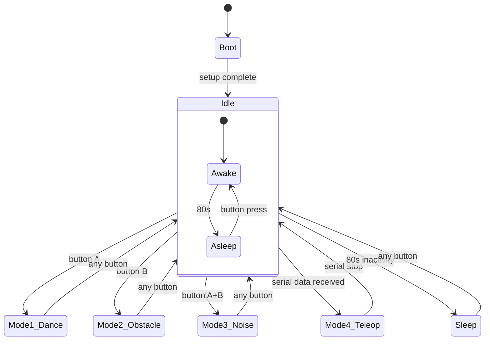

# ZOWI BASE v2

The default firmware for Zowi. Developed by BQ (Anita de Prado, Jose Alberca, Javier Isabel, Juan Gonzalez, Irene Sanz, December 2015). Released under GPL.

## Overview

ZOWI_BASE_v2 is the main firmware that ships with every Zowi robot. It implements a 5-mode state machine accessible via the back buttons, plus a full serial command protocol for remote control via the ZowiApp (Bluetooth).



## Modes

| Mode | Name | How to Select | Description |
|------|------|---------------|-------------|
| 0 | Idle | Default on boot | Zowi waits. After 80 seconds of inactivity, falls asleep (dream animation + snoring sounds). |
| 1 | Dance | Press button **A** | Zowi performs random dances. |
| 2 | Obstacle Detection | Press button **B** | Zowi walks autonomously, avoiding obstacles. |
| 3 | Noise Detection | Press **A + B** | Zowi reacts to claps/taps with a random dance. |
| 4 | Teleoperation | Serial data received | Zowi listens for serial commands from the ZowiApp. |

## Boot Sequence

On startup, `setup()` runs the following sequence:

### 1. Factory Name Check

```cpp
if (EEPROM.read(5) == '$') {
    EEPROM.put(5, '#');
    EEPROM.put(6, '\0');
    zowi.putMouth(culito);
    while(true) delay(1000);
}
```

If the EEPROM name is `$` (factory marker), Zowi writes `#` as the first name and enters an infinite loop showing a `culito` mouth. This is the **factory state** — the robot ships like this and only exits this loop when the user sets a name via the app.

### 2. Unbaptized Greeting

```cpp
if (EEPROM.read(5) == '#') {
    zowi.jump(1, 700);
    zowi.shakeLeg(1, T, 1);
    zowi.putMouth(smallSurprise);
    zowi.swing(2, 800, 20);
    zowi.home();
}
```

If the name is still `#` (never set by the user), Zowi performs an extended greeting animation (jump, shake leg, swing). Once the user sets a name via the app, this greeting is skipped on subsequent boots.

### 3. Boot Animations

After the name check, Zowi plays:
- A "littleUuh" mouth animation (2 cycles, 8 frames each)
- A smile + `S_happy` sound
- If unbaptized (`#`): jump, shake leg, and swing

### 4. Idle Loop

After setup, Zowi enters the main loop in Mode 0 (Idle). Every 80 seconds of inactivity, it falls asleep with a dream animation and snoring sounds.

## Mode Selection

Press any back button to wake Zowi and select a mode:

| Buttons | Mode | Sound |
|---------|------|-------|
| **A** only | 1 — Dance | `S_mode1` |
| **B** only | 2 — Obstacle Detection | `S_mode2` |
| **A + B** | 3 — Noise Detection | `S_mode3` |

The mode number is shown on the LED mouth for 2 seconds.

## Mode Logic

### Mode 0 — Idle

Zowi stands still with a happy mouth. After 80 seconds of inactivity, it falls asleep (`ZowiSleeping_withInterrupts`): leans forward, plays a 4-frame dream mouth animation with soft tones, then shows `lineMouth` and plays `S_cuddly`. Any button press interrupts the sleep.

### Mode 1 — Dance

Zowi picks a random dance (IDs 5–20) and performs it 1–5 times. For dances 15–18 (bend, shakeLeg), it does 1 repetition at a slower tempo (1600 ms). For all others, it does 3–5 repetitions at 1000 ms. A random mouth expression is shown during the dance.

### Mode 2 — Obstacle Detection

Zowi walks forward until it detects an obstacle within 15 cm. When an obstacle is found:

1. Shows `bigSurprise` mouth and plays `S_surprise`
2. Jumps 5 times
3. Shows `confused` mouth and plays `S_cuddly`
4. Takes 3 steps backward
5. Checks for obstacles again
6. If clear: smiles, turns left 3 times (checking after each turn), then shows `happyOpen` and plays `S_happy_short`
7. If still blocked: repeats the reaction

### Mode 3 — Noise Detection

Zowi listens for noise (analog reading ≥ 650 on the noise sensor). When detected:
1. Shows `bigSurprise` mouth and plays `S_OhOoh`
2. Shows a random mouth expression
3. Performs a random dance (IDs 5–20)
4. Returns to home and shows `happyOpen`

### Mode 4 — Teleoperation (ZowiPAD)

Activated automatically when serial data is received. Zowi disables button interrupts and processes serial commands via `ZowiSerialCommand`. The `move()` function is called repeatedly while `getRestState()` is false, allowing continuous motion commands.

## Serial Protocol

Baud rate: **115200**. All frames use `&&` ... `%%`.

### Commands (App → Zowi)

| Command | Arguments | Description |
|---------|-----------|-------------|
| `S` | — | Stop and return to home |
| `L` | `<30-bit binary>` | Write a raw 30-bit pattern to the LED matrix |
| `T` | `<freq> <duration>` | Play a tone (frequency in Hz, duration in ms) |
| `M` | `<moveId> <T> <moveSize>` | Execute a movement (see Movement IDs) |
| `H` | `<gestureId>` | Play a gesture (1–13) |
| `K` | `<singId>` | Play a song (1–19) |
| `C` | `<trimYL> <trimYR> <trimRL> <trimRR>` | Set servo trim offsets and save to EEPROM |
| `G` | `<YL> <YR> <RL> <RR>` | Move servos to raw positions (200 ms) |
| `R` | `<name>` | Set Zowi's name (stored in EEPROM[5..15]) |
| `E` | — | Request name → responds `&&E <name>%%` |
| `D` | — | Request distance → responds `&&D <cm>%%` |
| `N` | — | Request noise → responds `&&N <value>%%` |
| `B` | — | Request battery → responds `&&B <percent>%%` |
| `I` | — | Request program ID → responds `&&I ZOWI_BASE_v2%%` |

All responses are framed as `&&<command> <value>%%`. Every command that changes state sends `A` (ack) before execution and `F` (final ack) after completion.

## Movement IDs

| ID | Movement | Parameters |
|----|----------|------------|
| 0 | Home (stop) | — |
| 1 | Walk forward | `T` |
| 2 | Walk backward | `T` |
| 3 | Turn left | `T` |
| 4 | Turn right | `T` |
| 5 | Updown | `T`, `moveSize` |
| 6 | Moonwalker left | `T`, `moveSize` |
| 7 | Moonwalker right | `T`, `moveSize` |
| 8 | Swing | `T`, `moveSize` |
| 9 | Crusaito forward | `T`, `moveSize` |
| 10 | Crusaito backward | `T`, `moveSize` |
| 11 | Jump | `T` |
| 12 | Flapping forward | `T`, `moveSize` |
| 13 | Flapping backward | `T`, `moveSize` |
| 14 | Tiptoe swing | `T`, `moveSize` |
| 15 | Bend left | `T` |
| 16 | Bend right | `T` |
| 17 | Shake leg left | `T` |
| 18 | Shake leg right | `T` |
| 19 | Jitter | `T`, `moveSize` |
| 20 | Ascending turn | `T`, `moveSize` |

## Gesture IDs

| ID | Gesture |
|----|---------|
| 1 | ZowiHappy |
| 2 | ZowiSuperHappy |
| 3 | ZowiSad |
| 4 | ZowiSleeping |
| 5 | ZowiFart |
| 6 | ZowiConfused |
| 7 | ZowiLove |
| 8 | ZowiAngry |
| 9 | ZowiFretful |
| 10 | ZowiMagic |
| 11 | ZowiWave |
| 12 | ZowiVictory |
| 13 | ZowiFail |

## Song IDs

| ID | Song |
|----|------|
| 1 | S_connection |
| 2 | S_disconnection |
| 3 | S_surprise |
| 4 | S_OhOoh |
| 5 | S_OhOoh2 |
| 6 | S_cuddly |
| 7 | S_sleeping |
| 8 | S_happy |
| 9 | S_superHappy |
| 10 | S_happy_short |
| 11 | S_sad |
| 12 | S_confused |
| 13 | S_fart1 |
| 14 | S_fart2 |
| 15 | S_fart3 |
| 16 | S_mode1 |
| 17 | S_mode2 |
| 18 | S_mode3 |
| 19 | S_buttonPushed |

## Key Functions

### `obstacleDetector()`

Reads the ultrasonic sensor. If distance < 15 cm, sets `obstacleDetected = true`; otherwise `false`.

### `move(moveId)`

Executes a movement by ID (0–20). Sends `sendFinalAck()` after each movement except for manual servo mode (ID ≥ 30).

### `ZowiLowBatteryAlarm()`

If battery < 45%, flashes a `thunder` mouth and plays an alternating alarm tone (880 Hz ↔ 2000 Hz) until a button is pressed.

### `ZowiSleeping_withInterrupts()`

Zowi leans forward (servos to 100, 80, 60, 120) and plays a 4-frame dream mouth animation with soft rising/falling tones. After 4 cycles, shows `lineMouth` and plays `S_cuddly`. Fully interruptible by button press.

## Pin Mapping

| Function | Pin |
|----------|-----|
| YL servo | 2 |
| YR servo | 3 |
| RL servo | 4 |
| RR servo | 5 |
| Button A | 6 |
| Button B | 7 |
| US Trigger | 8 |
| US Echo | 9 |
| Buzzer | 10 |
| LED data (SER) | 11 |
| LED latch (RCK) | 12 |
| LED clock (CLK) | 13 |
| Noise sensor | A6 |
| Battery | A7 |
