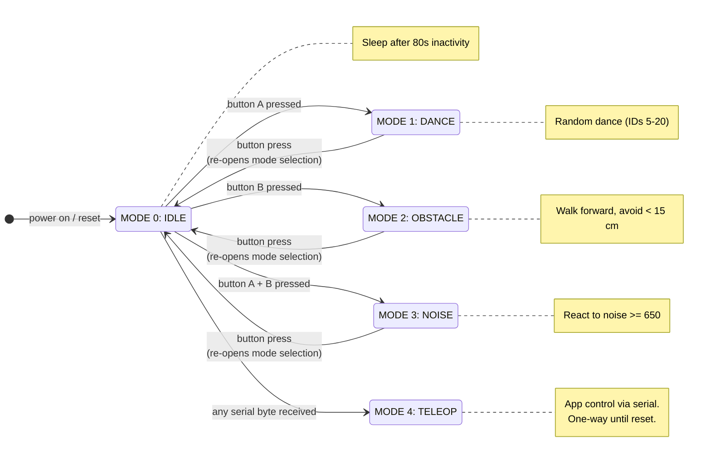
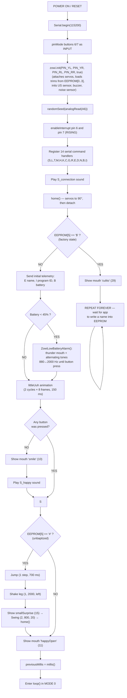
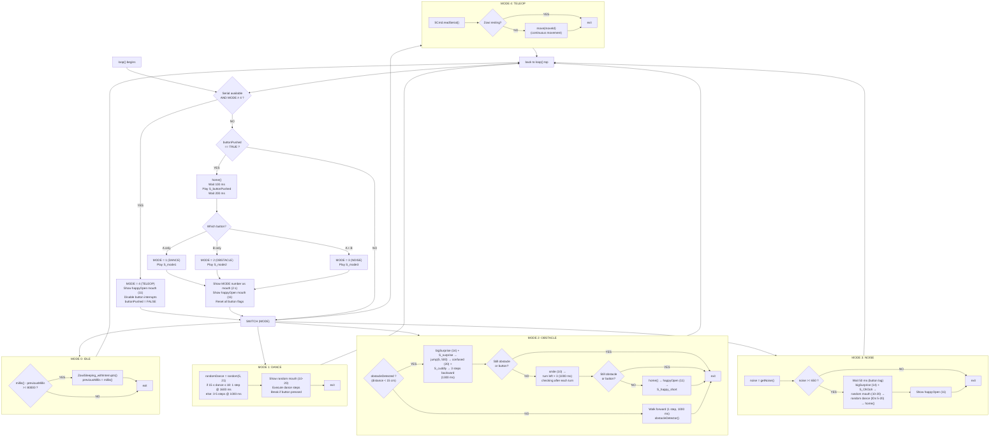
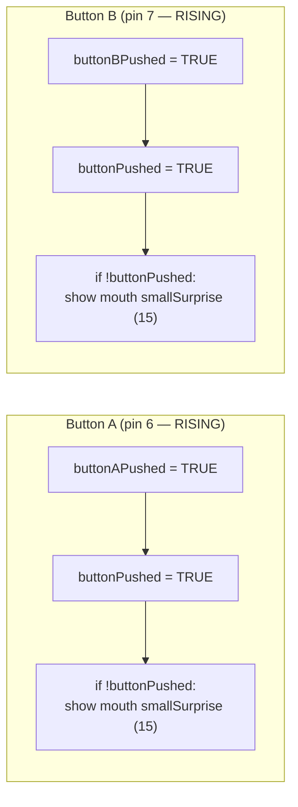

# ZOWI BASE v2

The default firmware for Zowi. Developed by BQ (Anita de Prado, Jose Alberca, Javier Isabel, Juan Gonzalez, Irene Sanz, December 2015). Released under GPL.

This document is the unified reference for `code/base/ZOWI_BASE_v2.ino` and its supporting libraries. It consolidates and supersedes the former `ZOWI_BASE_BLOCKS.md` and `ZOWI_BASE_BLOCKS_MERMAID.md`. All IDs and behaviors described here were verified against the source code.

## Contents

- [Overview](#overview)
- [Hardware & Pin Mapping](#hardware--pin-mapping)
- [Global State](#global-state)
- [State Machine](#state-machine)
- [Boot Sequence (setup)](#boot-sequence-setup)
- [Main Loop](#main-loop)
- [Mode Selection via Buttons](#mode-selection-via-buttons)
- [Button Interrupts](#button-interrupts)
- [Reading Buttons over Serial (Proposed)](#reading-buttons-over-serial-proposed)
- [Operating Modes](#operating-modes)
  - [Mode 0 — Idle & Sleep](#mode-0--idle--sleep)
  - [Mode 1 — Dance](#mode-1--dance)
  - [Mode 2 — Obstacle Detection](#mode-2--obstacle-detection)
  - [Mode 3 — Noise Detection](#mode-3--noise-detection)
  - [Mode 4 — Teleoperation (ZowiPAD)](#mode-4--teleoperation-zowipad)
- [Serial Protocol](#serial-protocol)
  - [Framing & Acknowledgements](#framing--acknowledgements)
  - [Commands (App → Zowi)](#commands-app--zowi)
  - [Sensor Reads over Serial](#sensor-reads-over-serial)
  - [Error Handling](#error-handling)
- [ID References](#id-references)
  - [Movement IDs (serial `M`)](#movement-ids-serial-m)
  - [Gesture IDs (serial `H` and library)](#gesture-ids-serial-h-and-library)
  - [Song IDs (serial `K` and library)](#song-ids-serial-k-and-library)
  - [Mouth IDs (LED Matrix)](#mouth-ids-led-matrix)
  - [Mouth Animations](#mouth-animations)
- [Sensors](#sensors)
  - [Ultrasonic Distance Sensor](#ultrasonic-distance-sensor)
  - [Noise Sensor](#noise-sensor)
  - [Battery Reader](#battery-reader)
- [Key Firmware Functions](#key-firmware-functions)
- [Servo Configuration & Calibration](#servo-configuration--calibration)
- [EEPROM Memory Map](#eeprom-memory-map)

---

## Overview

ZOWI_BASE_v2 is the main firmware that ships with every Zowi robot. It implements a 5-mode state machine selected via the back buttons, plus a full serial command protocol (115200 baud) for remote control and telemetry via the ZowiApp over Bluetooth (or USB serial — both go through the same `Serial` port).


```mermaid
stateDiagram-v2
    direction LR
    state "MODE 0: IDLE" as IDLE
    state "MODE 1: DANCE" as DANCE
    state "MODE 2: OBSTACLE" as OBSTACLE
    state "MODE 3: NOISE" as NOISE
    state "MODE 4: TELEOP" as TELEOP

    [*] --> IDLE : power on / reset

    IDLE --> DANCE : button A pressed
    IDLE --> OBSTACLE : button B pressed
    IDLE --> NOISE : button A + B pressed
    IDLE --> TELEOP : any serial byte received

    DANCE --> IDLE : button press<br/>(re-opens mode selection)
    OBSTACLE --> IDLE : button press<br/>(re-opens mode selection)
    NOISE --> IDLE : button press<br/>(re-opens mode selection)

    note right of IDLE : Sleep after 80s inactivity
    note right of DANCE : Random dance (IDs 5-20)
    note right of OBSTACLE : Walk forward, avoid < 15 cm
    note right of NOISE : React to noise >= 650
    note right of TELEOP : App control via serial.<br/>One-way until reset.
```

> **Note:** MODE 4 disables button interrupts and they are never re-enabled, so the only ways out of teleoperation mode are a reset/power cycle (or re-selecting a mode before entering it).

---

## Hardware & Pin Mapping

| Function | Pin |
|----------|-----|
| YL servo (left hip) | 2 |
| YR servo (right hip) | 3 |
| RL servo (left foot) | 4 |
| RR servo (right foot) | 5 |
| Button A (`PIN_SecondButton`) | 6 |
| Button B (`PIN_ThirdButton`) | 7 |
| US Trigger | 8 |
| US Echo | 9 |
| Buzzer | 10 |
| LED data (SER) | 11 |
| LED latch (RCK) | 12 |
| LED clock (CLK) | 13 |
| Noise sensor (`PIN_NoiseSensor`) | A6 |
| Battery (`BAT_PIN`) | A7 |

The LED matrix is a 5×6 grid (30 bits) driven by a 74HC595 shift register (`LedMatrix` library).

---

## Global State

| Variable | Type | Init | Purpose |
|----------|------|------|---------|
| `programID[]` | `const char[]` | `"ZOWI_BASE_v2"` | Identifier reported by serial command `I` |
| `name_fac` / `name_fir` | `char` | `'$'` / `'#'` | EEPROM factory / unbaptized name markers |
| `T`, `moveId`, `moveSize` | `int` | 1000, 0, 15 | Current movement period, ID, and height |
| `MODE` | `volatile int` | 0 | Active mode of the state machine |
| `buttonPushed` | `volatile bool` | false | Any button pressed since last handling |
| `buttonAPushed` / `buttonBPushed` | `volatile bool` | false | Which button(s) were pressed |
| `previousMillis` | `unsigned long` | 0 | Idle-mode sleep timer |
| `obstacleDetected` | `bool` | false | Last ultrasonic reading below 15 cm |

---

## State Machine

- `MODE` is a `volatile int` with five valid values (0-4). Any other value falls back to 4 (teleoperation).
- Receiving any serial byte while `MODE != 4` immediately switches to MODE 4 and disables button interrupts.
- In modes 1-3, a button press aborts the current activity and re-opens mode selection.
- In MODE 0, after 80 seconds of inactivity Zowi falls asleep (interruptible by any button).

---

## Boot Sequence (setup)


```mermaid
flowchart TD
    A["POWER ON / RESET"] --> B["Serial.begin(115200)"]
    B --> B2["pinMode buttons 6/7 as INPUT"]
    B2 --> C["zowi.init(PIN_YL, PIN_YR, PIN_RL, PIN_RR, true)<br/>(attaches servos, loads trims from EEPROM[0..3],<br/>inits US sensor, buzzer, noise sensor)"]
    C --> D["randomSeed(analogRead(A6))"]
    D --> E["enableInterrupt pin 6 and pin 7 (RISING)"]
    E --> F["Register 14 serial command handlers (S,L,T,M,H,K,C,G,R,E,D,N,B,I)"]
    F --> G["Play S_connection sound"]
    G --> H["home() — servos to 90°, then detach"]

    H --> I{"EEPROM[5] == '$' ?<br/>(factory state)"}
    I -->|"YES"| J["Show mouth 'culito' (29)"]
    J --> K["REPEAT FOREVER — wait for app<br/>to write a name into EEPROM"]
    K --> K

    I -->|"NO"| L["Send initial telemetry:<br/>E name, I program ID, B battery"]

    L --> M{"Battery < 45% ?"}
    M -->|"YES"| N["ZowiLowBatteryAlarm():<br/>thunder mouth + alternating tones<br/>880↔2000 Hz until button press"]

    M -->|"NO"| O["littleUuh animation<br/>(2 cycles × 8 frames, 150 ms)"]

    N --> O
    O --> P{"Any button<br/>was pressed?"}
    P -->|"NO"| Q["Show mouth 'smile' (10)"]
    Q --> R["Play S_happy sound"]
    R --> S

    P -->|"YES"| S

    S --> T{"EEPROM[5] == '#' ?<br/>(unbaptized)"}
    T -->|"YES"| U["Jump (1 step, 700 ms)"]
    U --> V["Shake leg (1, 2000, left)"]
    V --> W["Show smallSurprise (15) →<br/>Swing (2, 800, 20) → home()"]
    W --> X

    T -->|"NO"| X["Show mouth 'happyOpen' (11)"]

    X --> Z["previousMillis = millis()"]
    Z --> END["Enter loop() in MODE 0"]
```

Key details:

1. **Factory state check** — if `EEPROM[5] == '$'`, Zowi shows the `culito` mouth and enters an infinite loop. This is the state the robot ships in; it only exits when the app writes a name via serial command `R`.
2. **Initial telemetry** — `requestName()`, `requestProgramId()`, and `requestBattery()` are sent at boot so the app immediately learns the name, program ID, and battery level.
3. **Low battery alarm** — if battery < 45%, the alarm loop runs until a button is pressed.
4. **Unbaptized greeting** — if `EEPROM[5] == '#'`, Zowi performs an extended greeting (jump, shake leg, swing). Once a name is set, this is skipped on subsequent boots.

---

## Main Loop


```mermaid
flowchart TD
    START["loop() begins"] --> SERIAL_CHECK{"Serial available<br/>AND MODE ≠ 4 ?"}

    SERIAL_CHECK -->|"YES"| SERIAL_ENTER["MODE = 4 (TELEOP)<br/>Show happyOpen mouth (11)<br/>Disable button interrupts<br/>buttonPushed = FALSE"]
    SERIAL_ENTER --> MAIN

    SERIAL_CHECK -->|"NO"| BTN_CHECK{"buttonPushed<br/>== TRUE ?"}

    BTN_CHECK -->|"YES"| BTN_HANDLE["home()<br/>Wait 100 ms<br/>Play S_buttonPushed<br/>Wait 200 ms"]

    BTN_HANDLE --> BTN_SELECT{"Which button?"}
    BTN_SELECT -->|"A only"| MODE1_SET["MODE = 1 (DANCE)<br/>Play S_mode1"]
    BTN_SELECT -->|"B only"| MODE2_SET["MODE = 2 (OBSTACLE)<br/>Play S_mode2"]
    BTN_SELECT -->|"A + B"| MODE3_SET["MODE = 3 (NOISE)<br/>Play S_mode3"]

    MODE1_SET --> BTN_CLEANUP
    MODE2_SET --> BTN_CLEANUP
    MODE3_SET --> BTN_CLEANUP

    BTN_CLEANUP["Show MODE number as mouth (2 s)<br/>Show happyOpen mouth (11)<br/>Reset all button flags"] --> MAIN

    BTN_CHECK -->|"NO"| MAIN

    MAIN["SWITCH (MODE)"] --> MODE0
    MAIN --> MODE1
    MAIN --> MODE2
    MAIN --> MODE3
    MAIN --> MODE4

    subgraph MODE0["MODE 0: IDLE"]
        M0_CHECK{"millis() - previousMillis<br/>>= 80000 ?"}
        M0_CHECK -->|"YES"| M0_SLEEP["ZowiSleeping_withInterrupts()<br/>previousMillis = millis()"]
        M0_SLEEP --> M0_EXIT
        M0_CHECK -->|"NO"| M0_EXIT
        M0_EXIT["exit"]
    end

    subgraph MODE1["MODE 1: DANCE"]
        M1_PICK["randomDance = random(5, 21)<br/>if 15 ≤ dance ≤ 18: 1 step @ 1600 ms<br/>else: 3-5 steps @ 1000 ms"]
        M1_LOOP["Show random mouth (10-20)<br/>Execute dance steps<br/>Break if button pressed"]
        M1_PICK --> M1_LOOP --> M1_EXIT
        M1_EXIT["exit"]
    end

    subgraph MODE2["MODE 2: OBSTACLE"]
        M2_CHECK{"obstacleDetected ?<br/>(distance < 15 cm)"}
        M2_CHECK -->|"YES"| M2_REACT["bigSurprise (14) + S_surprise →<br/>jump(5, 500) → confused (20) +<br/>S_cuddly → 3 steps backward<br/>(1300 ms)"]
        M2_REACT --> M2_VERIFY{"Still obstacle<br/>or button?"}
        M2_VERIFY -->|"YES"| M2_EXIT
        M2_VERIFY -->|"NO"| M2_TURN["smile (10) →<br/>turn left × 3 (1000 ms)<br/>checking after each turn"]
        M2_TURN --> M2_HAPPY{"Still obstacle<br/>or button?"}
        M2_HAPPY -->|"NO"| M2_END["home() → happyOpen (11) →<br/>S_happy_short"]
        M2_HAPPY -->|"YES"| M2_EXIT
        M2_END --> M2_EXIT
        M2_CHECK -->|"NO"| M2_FWD["Walk forward (1 step, 1000 ms)<br/>obstacleDetector()"]
        M2_FWD --> M2_EXIT
        M2_EXIT["exit"]
    end

    subgraph MODE3["MODE 3: NOISE"]
        M3_NOISE["noise = getNoise()"]
        M3_NOISE --> M3_CHECK{"noise >= 650 ?"}
        M3_CHECK -->|"NO"| M3_EXIT
        M3_CHECK -->|"YES"| M3_REACT["Wait 50 ms (button lag)<br/>bigSurprise (14) + S_OhOoh →<br/>random mouth (10-20) →<br/>random dance (IDs 5-20) → home()"]
        M3_REACT --> M3_END["Show happyOpen (11)"]
        M3_END --> M3_EXIT
        M3_EXIT["exit"]
    end

    subgraph MODE4["MODE 4: TELEOP"]
        M4_READ["SCmd.readSerial()"]
        M4_READ --> M4_MOVE{"Zowi resting?"}
        M4_MOVE -->|"NO"| M4_EXEC["move(moveId)<br/>(continuous movement)"]
        M4_MOVE -->|"YES"| M4_EXIT
        M4_EXEC --> M4_EXIT
        M4_EXIT["exit"]
    end

    MODE1 --> LOOP_END
    MODE2 --> LOOP_END
    MODE3 --> LOOP_END
    MODE4 --> LOOP_END
    MODE0 --> LOOP_END

    LOOP_END["back to loop() top"]
    LOOP_END --> SERIAL_CHECK
```

---

## Mode Selection via Buttons

Press any back button to wake Zowi and open the mode selector:

| Buttons | Mode | Sound |
|---------|------|-------|
| **A** only | 1 — Dance | `S_mode1` |
| **B** only | 2 — Obstacle Detection | `S_mode2` |
| **A + B** | 3 — Noise Detection | `S_mode3` |

The selected mode number is displayed on the LED mouth for 2 seconds, then `happyOpen` is shown. Button flags are reset afterwards.

## Button Interrupts

Buttons are handled with the `EnableInterrupt` library on **rising edges**, configured only in `setup()`:


```mermaid
flowchart LR
    subgraph BTN_A["Button A (pin 6 — RISING)"]
        A1["buttonAPushed = TRUE"] --> A2["buttonPushed = TRUE"] --> A3["if !buttonPushed:<br/>show mouth smallSurprise (15)"]
    end

    subgraph BTN_B["Button B (pin 7 — RISING)"]
        B1["buttonBPushed = TRUE"] --> B2["buttonPushed = TRUE"] --> B3["if !buttonPushed:<br/>show mouth smallSurprise (15)"]
    end
```

> **Buttons are not exposed over serial.** There is no serial command that reports button state, and MODE 4 (the only mode that processes serial commands) explicitly disables these interrupts — so while teleoperating, not even the local flags above update. See [Reading Buttons over Serial (Proposed)](#reading-buttons-over-serial-proposed) for how to add this capability.

---

## Reading Buttons over Serial (Proposed)

This section describes a **proposed firmware extension** — it is *not* present in the shipped `ZOWI_BASE_v2.ino`.

Current state of button availability:

| Interface | Readable? | Mechanism |
|-----------|-----------|-----------|
| Locally (inside the firmware) | Yes | ISRs set `buttonPushed`/`buttonAPushed`/`buttonBPushed` (modes 0-3); `digitalRead(6/7)` works anywhere |
| Over serial (stock firmware) | **No** | No command reports button state; MODE 4 disables the button interrupts on entry |

Hardware note: buttons sit on pins 6 (A) and 7 (B), configured as plain `INPUT`. Since the stock firmware detects presses on **RISING** edges, a press drives the pin HIGH — so `digitalRead(pin) == 1` means *pressed*.

### Option 1 — Polling command (recommended)

Add a new serial command (e.g., `J`) that reports the instantaneous state of both buttons. It has no side effects on the state machine and works immediately in MODE 4:

```cpp
//-- 1. In setup(), register the command next to the other requests:
SCmd.addCommand("J", requestButtons);

//-- 2. Handler: reports button state as two bits (<A><B>)
void requestButtons(){

    int a = digitalRead(PIN_SecondButton);
    int b = digitalRead(PIN_ThirdButton);

    Serial.print(F("&&"));
    Serial.print(F("J "));
    Serial.print(a);
    Serial.print(b);
    Serial.println(F("%%"));
    Serial.flush();
}
```

Response examples: `&&J 00%%` (none), `&&J 10%%` (A), `&&J 01%%` (B), `&&J 11%%` (both).

Limitation: it is a per-request snapshot — presses shorter than the polling interval can be missed, and there is no event push.

### Option 2 — Re-enable interrupts in MODE 4

Track presses with the existing ISRs while teleoperating:

```cpp
//-- In the MODE 4 entry block of loop() (after disableInterrupt calls),
//-- re-enable the button interrupts:
enableInterrupt(PIN_SecondButton, secondButtonPushed, RISING);
enableInterrupt(PIN_ThirdButton, thirdButtonPushed, RISING);
```

**Caveat:** the top of `loop()` treats `buttonPushed == true` as "open the mode selector", which would kick Zowi out of MODE 4 on every press. To avoid this, the reported flags must be consumed *before* the mode-selection branch runs, e.g.:

- In the MODE 4 case, report and clear `buttonPushed`/`buttonAPushed`/`buttonBPushed` (via command `J`), **and**
- Guard the mode-selection branch with `MODE != 4`, or use a separate flag that only the ISRs set and only MODE 4 consumes.

This gives event-latched detection (no missed short presses) at the cost of touching the main loop's control flow.

### Option 3 — Continuous button telemetry

Instead of a request/response command, MODE 4's loop could send `&&J <A><B>%%` (or an event frame `&&J P<A|B>%%`) whenever a flag changes. Most invasive; only worth it if the host app needs real-time button events.

### Comparison

| Option | Misses short presses | Touches control flow | Effort |
|--------|----------------------|----------------------|--------|
| 1 — Polling `J` | Possible | None | Minimal |
| 2 — Interrupts in MODE 4 | No | Yes (loop + flag consumption) | Moderate |
| 3 — Telemetry stream | No | Yes (loop + protocol) | Highest |

---

## Operating Modes

### Mode 0 — Idle & Sleep

Zowi stands still with a happy mouth. Every 80 seconds of inactivity, `ZowiSleeping_withInterrupts()` runs:

1. Leans forward: servos to `{YL=100, YR=80, RL=60, RR=120}` over 700 ms
2. 4 dream cycles: `dreamMouth` frames 0→1→2 (rising tones 100→500 Hz), pause, frames 1→0 (falling tones 400→100 Hz)
3. Shows `lineMouth` (19) and plays `S_cuddly`
4. Returns `home()` and shows `happyOpen` (11)

Every step checks `buttonPushed` and aborts on press.

### Mode 1 — Dance

Picks a random dance ID 5-20 (`random(5,21)`):

- IDs 15-18 (bend, shakeLeg): 1 repetition at 1600 ms
- All others: 3-5 repetitions (`random(3,6)`) at 1000 ms

A random mouth (IDs 10-20) is shown during the dance. The dance loop breaks on button press.

### Mode 2 — Obstacle Detection

Zowi walks forward (1 step at 1000 ms per loop iteration) while checking `obstacleDetector()` after each step. When an obstacle (< 15 cm) is detected:

1. Shows `bigSurprise` (14) and plays `S_surprise`, then jumps 5 times (500 ms)
2. Shows `confused` (20) and plays `S_cuddly`
3. Takes 3 steps backward (1300 ms each)
4. Re-checks; if still blocked or a button was pressed, stops
5. If clear: shows `smile` (10) and turns left 3 times (1000 ms), re-checking after each turn
6. If still clear: `home()`, shows `happyOpen` (11), plays `S_happy_short`

### Mode 3 — Noise Detection

Reads `zowi.getNoise()`. If ≥ 650 (raw analog value):

1. Waits 50 ms (buttons may trigger the noise sensor before their interrupt fires)
2. Shows `bigSurprise` (14) and plays `S_OhOoh`
3. Shows a random mouth (IDs 10-20)
4. Performs a random dance (IDs 5-20), then `home()` and 500 ms pause
5. Shows `happyOpen` (11)

### Mode 4 — Teleoperation (ZowiPAD)

Activated **automatically** the first time any serial byte arrives (`Serial.available() > 0 && MODE != 4`). On entry:

- Shows `happyOpen` (11)
- Disables button interrupts on pins 6 and 7 (never re-enabled until reset)
- Resets `buttonPushed`

Each loop iteration calls `SCmd.readSerial()` to parse commands, and while Zowi is not resting, keeps calling `move(moveId)` for continuous motion (e.g., walking until an `S` stop command arrives). Movement parameters persist between commands.

---

## Serial Protocol

- Baud rate: **115200** (same port for USB and Bluetooth adapters).
- Commands are only processed **in MODE 4**. Sending any byte from any other mode switches Zowi into MODE 4 first.
- Unknown commands fall through to the default handler, which behaves like `S` (stop: ack → home → final ack).

### Framing & Acknowledgements

- Requests from the app: `<CMD> [arg1] [arg2] ...`
- Action commands reply `&&A%%` (ack) *before* executing and `&&F%%` (final ack) *after* completing.
- Read-only request commands reply directly with `&&<CMD> <value>%%` (no acks).

### Commands (App → Zowi)

| Command | Arguments | Response | Description |
|---------|-----------|----------|-------------|
| `S` | — | `&&A%%` → home → `&&F%%` | Stop: return to home position |
| `L` | `<30-bit binary>` | `&&A%%` → `&&F%%` | Write a raw 30-bit pattern to the LED matrix (parsed with `strtoul` base 2) |
| `T` | `<freq> <duration>` | `&&A%%` → `&&F%%` | Play a tone (Hz, ms) |
| `M` | `<moveId> <T> <moveSize>` | `&&A%%` → move (repeats while moving) → `&&F%%` | Set and start a movement (see [Movement IDs](#movement-ids-serial-m)) |
| `H` | `<gestureId>` (1-13) | `&&A%%` → gesture → `&&F%%` | Play a gesture |
| `K` | `<songId>` (1-19) | `&&A%%` → song → `&&F%%` | Play a song |
| `C` | `<trimYL> <trimYR> <trimRL> <trimRR>` | `&&A%%` → EEPROM save → `&&F%%` | Set servo trim offsets (RAM) and save to EEPROM[0..3] |
| `G` | `<YL> <YR> <RL> <RR>` | `&&A%%` → 200 ms raw servo move → `&&F%%` | Move servos to raw positions; sets `moveId = 30` (manual mode) |
| `R` | `<name>` | `&&A%%` → EEPROM save → `&&F%%` | Set Zowi's name (up to 10 chars, stored at EEPROM[5..15]) |
| `E` | — | `&&E <name>%%` | Request Zowi's name |
| `D` | — | `&&D <cm>%%` | Request ultrasonic distance (999 = no echo/timeout) |
| `N` | — | `&&N <value>%%` | Request noise level (0-1023) |
| `B` | — | `&&B <percent>%%` | Request battery level (% , two decimals) |
| `I` | — | `&&I ZOWI_BASE_v2%%` | Request program ID |

Examples: `M 1 1000` (walk forward), `M 5 1000 30` (updown, size 30), `L 000000001000010100100011000000000`, `C 20 0 -8 3`, `G 90 85 96 78`.

### Sensor Reads over Serial

Sensors are read **on demand only** — there is no continuous telemetry stream; the app must poll:

| Sensor | Command | Response | Rate |
|--------|---------|----------|------|
| Ultrasonic distance | `D` | `&&D <cm>%%` | One measurement per request |
| Noise | `N` | `&&N <value>%%` | Averaged sample per request |
| Battery | `B` | `&&B <percent>%%` | Averaged sample per request |
| Buttons | — | *not available* | Not exposed over serial — see [Reading Buttons over Serial (Proposed)](#reading-buttons-over-serial-proposed) |

Every read command calls `zowi.home()` first, stopping any movement in progress.

### Error Handling

When a command receives missing/invalid arguments, the handler shows the `xMouth` (26) for 2 seconds, clears the mouth, and (for `M` with no ID) sets `moveId = 0` (stop). No error frame is sent back — the ack frames are still emitted.

---

## ID References

### Movement IDs (serial `M`)

| ID | Movement | Zowi Method | Parameters |
|----|----------|-------------|------------|
| 0 | Home (stop) | `home()` | — |
| 1 | Walk forward | `walk(1, T, 1)` | `T` |
| 2 | Walk backward | `walk(1, T, -1)` | `T` |
| 3 | Turn left | `turn(1, T, 1)` | `T` |
| 4 | Turn right | `turn(1, T, -1)` | `T` |
| 5 | Updown | `updown(1, T, moveSize)` | `T`, `moveSize` |
| 6 | Moonwalker left | `moonwalker(1, T, moveSize, 1)` | `T`, `moveSize` |
| 7 | Moonwalker right | `moonwalker(1, T, moveSize, -1)` | `T`, `moveSize` |
| 8 | Swing | `swing(1, T, moveSize)` | `T`, `moveSize` |
| 9 | Crusaito forward | `crusaito(1, T, moveSize, 1)` | `T`, `moveSize` |
| 10 | Crusaito backward | `crusaito(1, T, moveSize, -1)` | `T`, `moveSize` |
| 11 | Jump | `jump(1, T)` | `T` |
| 12 | Flapping forward | `flapping(1, T, moveSize, 1)` | `T`, `moveSize` |
| 13 | Flapping backward | `flapping(1, T, moveSize, -1)` | `T`, `moveSize` |
| 14 | Tiptoe swing | `tiptoeSwing(1, T, moveSize)` | `T`, `moveSize` |
| 15 | Bend left | `bend(1, T, 1)` | `T` |
| 16 | Bend right | `bend(1, T, -1)` | `T` |
| 17 | Shake leg left | `shakeLeg(1, T, 1)` | `T` |
| 18 | Shake leg right | `shakeLeg(1, T, -1)` | `T` |
| 19 | Jitter | `jitter(1, T, moveSize)` | `T`, `moveSize` |
| 20 | Ascending turn | `ascendingTurn(1, T, moveSize)` | `T`, `moveSize` |
| ≥ 21 | Manual servo mode | — | No movement via `move()`; used by the `G` command (sets `moveId = 30`) |

`move()` sends `&&F%%` after every executed movement **except** in manual mode (any ID outside 0-20).

### Gesture IDs (serial `H` and library)

The serial command `H` accepts 1-13. Internally these map to the library defines in `Zowi_gestures.h` (0-12), used by `zowi.playGesture()`.

| Serial `H` | Library ID | Gesture | Sequence |
|-----------:|-----------:|---------|----------|
| 1 | 0 (`ZowiHappy`) | Happy | `S_happy` → swing → mouth `smile` (10) |
| 2 | 1 (`ZowiSuperHappy`) | Super Happy | `S_happy` + `S_superHappy` → tiptoe swing |
| 3 | 2 (`ZowiSad`) | Sad | sad position → descending tones → sad mouth |
| 4 | 3 (`ZowiSleeping`) | Sleeping | bed position → `dreamMouth` animation → `S_sleeping` |
| 5 | 4 (`ZowiFart`) | Fart | 3 positions → 3 fart sounds → `tongueOut` (16) |
| 6 | 5 (`ZowiConfused`) | Confused | confused position → `S_confused` → `confused` (20) |
| 7 | 6 (`ZowiLove`) | Love | heart mouth (13) → `S_cuddly` → crusaito |
| 8 | 7 (`ZowiAngry`) | Angry | angry position → `S_confused` → jitter |
| 9 | 8 (`ZowiFretful`) | Fretful | angry face → fretful oscillation |
| 10 | 9 (`ZowiMagic`) | Magic | 4 adivinawi cycles + ascending/descending tones |
| 11 | 10 (`ZowiWave`) | Wave | 2 wave cycles + tone sweep |
| 12 | 11 (`ZowiVictory`) | Victory | legs up + tones → tiptoe swing → `S_happy` |
| 13 | 12 (`ZowiFail`) | Fail | progressive bend + descending tones → detach servos → long low tone |

### Song IDs (serial `K` and library)

The serial command `K` accepts 1-19. The library `zowi.sing()` uses its own IDs 0-18 (`Zowi_sounds.h`). The two numbering schemes are **not** identical:

| Serial `K` | Library `sing()` ID | Song | Notes |
|-----------:|--------------------:|------|-------|
| 1 | 0 (`S_connection`) | Connection | Power-on jingle |
| 2 | 1 (`S_disconnection`) | Disconnection | Power-off jingle |
| 3 | 6 (`S_surprise`) | Surprise (OhOoh) | |
| 4 | 7 (`S_OhOoh`) | OhOoh | |
| 5 | 8 (`S_OhOoh2`) | OhOoh (alternate) | |
| 6 | 9 (`S_cuddly`) | Cuddly | Affectionate melody |
| 7 | 10 (`S_sleeping`) | Sleeping | Lullaby |
| 8 | 11 (`S_happy`) | Happy | |
| 9 | 12 (`S_superHappy`) | Super Happy | |
| 10 | 13 (`S_happy_short`) | Happy (short) | |
| 11 | 14 (`S_sad`) | Sad | |
| 12 | 15 (`S_confused`) | Confused | |
| 13 | 16 (`S_fart1`) | Fart 1 | |
| 14 | 17 (`S_fart2`) | Fart 2 | |
| 15 | 18 (`S_fart3`) | Fart 3 | |
| 16 | 3 (`S_mode1`) | Mode 1 (dance) | Mode activation |
| 17 | 4 (`S_mode2`) | Mode 2 (obstacle) | Mode activation |
| 18 | 5 (`S_mode3`) | Mode 3 (noise) | Mode activation |
| 19 | 2 (`S_buttonPushed`) | Button pushed | UI feedback |

Low-level sound primitives:

- `_tone(freq_Hz, duration_ms, silentDuration)` — wraps Arduino `tone()`
- `bendTones(init_Hz, final_Hz, prop, duration_ms, silentDuration)` — frequency sweep that multiplies/divides the frequency by `prop` each iteration

### Mouth IDs (LED Matrix)

Predefined shapes (`zowi.putMouth(id)`, `Zowi_mouths.h`), selected by index 0-30:

| ID | Shape | ID | Shape | ID | Shape |
|---:|-------|---:|-------|---:|-------|
| 0-9 | Digits 0-9 | 11 | happyOpen | 22 | sad |
| 10 | smile | 12 | happyClosed | 23 | sadOpen |
| | | 13 | heart | 24 | sadClosed |
| | | 14 | bigSurprise | 25 | okMouth |
| | | 15 | smallSurprise | 26 | xMouth (error) |
| | | 16 | tongueOut | 27 | interrogation |
| | | 17 | vamp1 | 28 | thunder (low battery) |
| | | 18 | vamp2 | 29 | culito (factory) |
| | | 19 | lineMouth | 30 | angry |
| | | 20 | confused | | |
| | | 21 | diagonal | | |

Random mouths used by dances (`random(10,21)`) cover IDs 10-20 (smile through confused).

A **raw mouth** can also be written directly as a 30-bit binary pattern via the serial `L` command (bypasses the ID table).

### Mouth Animations

| Animation | Library ID | Frames | Description |
|-----------|-----------:|--------|-------------|
| littleUuh | 0 | 8 | Small blinking mouth (boot surprise) |
| dreamMouth | 1 | 4 | Dreamy mouth with closed eyes (sleep) |
| adivinawi | 2 | 6 | Guessing / magic mouth |
| wave | 3 | 10 | Wave pattern |

---

## Sensors

### Ultrasonic Distance Sensor

- Pins: Trigger 8, Echo 9 (`US` library)
- Sequence: 2 µs LOW → 10 µs HIGH trigger pulse → `pulseIn(echo, HIGH, 40000)` (40 ms timeout)
- Distance = echo microseconds / 29 / 2 (cm)
- No echo (timeout) returns **999**
- Exposed to firmware via `zowi.getDistance()` and to the app via serial `D`

### Noise Sensor

- Pin: A6 (analog microphone, `INPUT`)
- `zowi.getNoise()`: one discarded initial read, then the average of **2 further readings** (4 ms apart), returning 0-1023
- Exposed to the app via serial `N`; also used by Mode 3 (threshold ≥ 650) and as the `randomSeed()` source at boot

### Battery Reader

- Pin: A7 (`BatReader` library, `ANA_REF = 5 V`)
- `readBatVoltage()`: single ADC read scaled to volts, capped at 4.2 V
- `readBatPercent()`: linear map of voltage between `BAT_MIN = 3.25 V` (0%) and `BAT_MAX = 4.2 V` (100%), clamped at 0
- `zowi.getBatteryLevel()` / `getBatteryVoltage()`: discard the first reading (often wrong), then average **10 readings** (1 ms apart)
- Exposed to the app via serial `B`; checked at boot (< 45% triggers the alarm)

---

## Key Firmware Functions

### `obstacleDetector()`

Reads `zowi.getDistance()` and sets `obstacleDetected = true` if distance < 15 cm, `false` otherwise.

### `move(moveId)`

Executes the movement matching [Movement IDs](#movement-ids-serial-m) (0-20). Sends `&&F%%` after each execution unless in manual mode (ID ≥ 21). Called by the serial `M` handler and continuously from the MODE 4 loop while Zowi is not resting.

### `ZowiLowBatteryAlarm()`

If battery < 45%, flashes the `thunder` (28) mouth and plays alternating tones (880 Hz ↔ 2000 Hz sweeps) until a button is pressed. Runs at boot.

### `ZowiSleeping_withInterrupts()`

The Mode 0 sleep animation described in [Mode 0 — Idle & Sleep](#mode-0--idle--sleep). Fully interruptible by button press.

---

## Servo Configuration & Calibration

| Pin | Identifier | Servo | Role |
|-----|------------|-------|------|
| 2 | `PIN_YL` | YL | Left hip (leg) |
| 3 | `PIN_YR` | YR | Right hip (leg) |
| 4 | `PIN_RL` | RL | Left foot |
| 5 | `PIN_RR` | RR | Right foot |

Servo functions used by the firmware:

- `attachServos()` / `detachServos()` — attach/detach each servo to its pin
- `home()` — move all servos to 90° (500 ms), then detach (rest position)
- `_moveServos(time, targets[4])` — interpolated raw move used by `G` (200 ms) and sleep (700 ms)
- `setTrims(YL, YR, RL, RR)` + `saveTrimsOnEEPROM()` — set calibration offsets in RAM and persist to EEPROM[0..3]; loaded automatically by `zowi.init(..., load_calibration=true)` at boot (values > 128 are interpreted as signed negative offsets)

Calibration is done over serial with the `C` command.

---

## EEPROM Memory Map

| Bytes | Usage | Values |
|-------|-------|--------|
| 0-3 | Servo trims | YL, YR, RL, RR (1 byte each; read as signed) |
| 4 | (free) | — |
| 5 | State marker | `'$'` = factory (infinite `culito` loop on boot), `'#'` = unbaptized (extended greeting), other = active name |
| 5-15 | Name | Up to 10 characters + null terminator (`\0`) |

---

*Unified from the former `ZOWI_BASE_BLOCKS.md` and `ZOWI_BASE_BLOCKS_MERMAID.md`. Generated from `code/base/ZOWI_BASE_v2.ino` and the supporting libraries (`Zowi`, `US`, `BatReader`, `LedMatrix`, `Oscillator`, `EnableInterrupt`, `ZowiSerialCommand`).*
