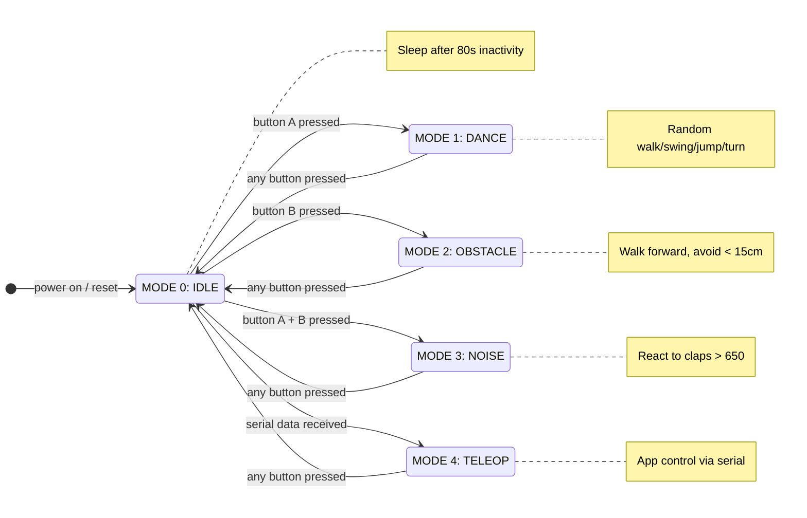
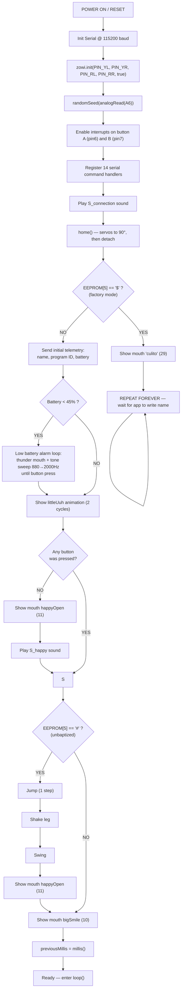
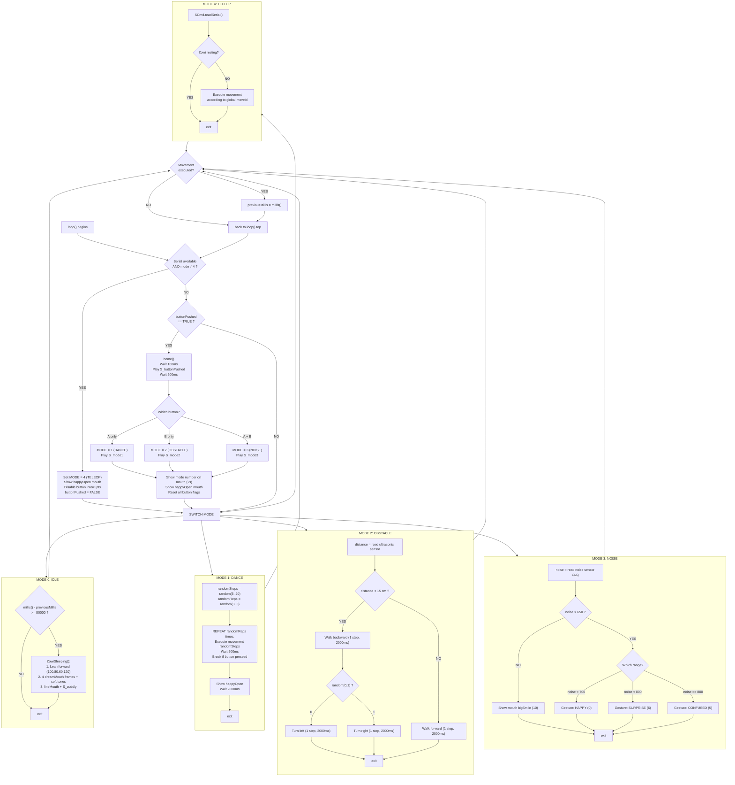
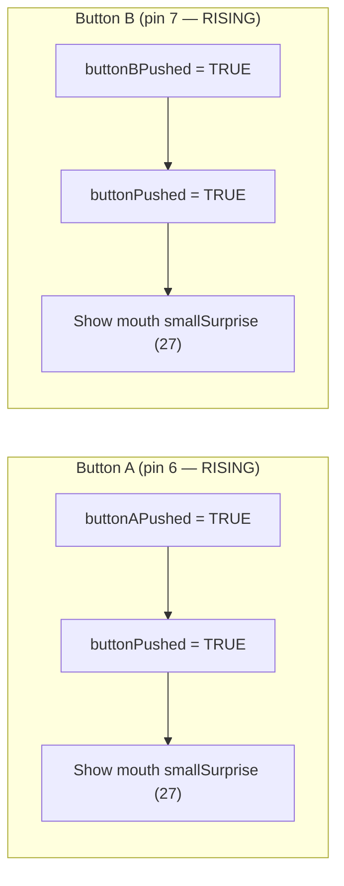
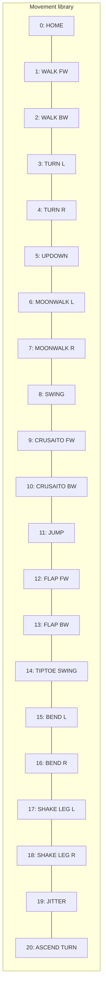
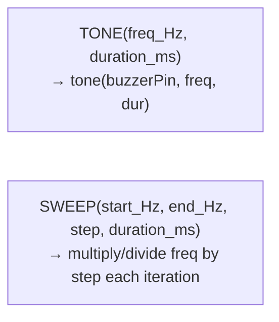
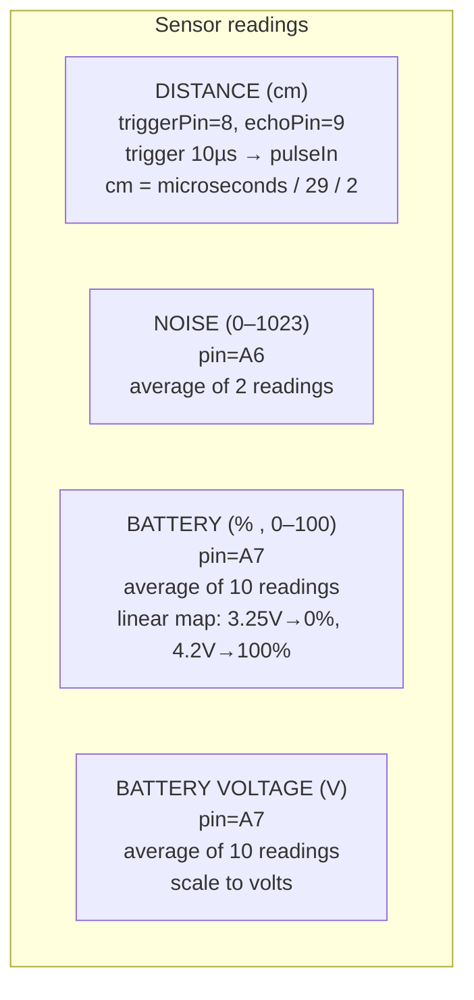
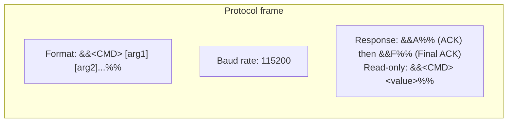
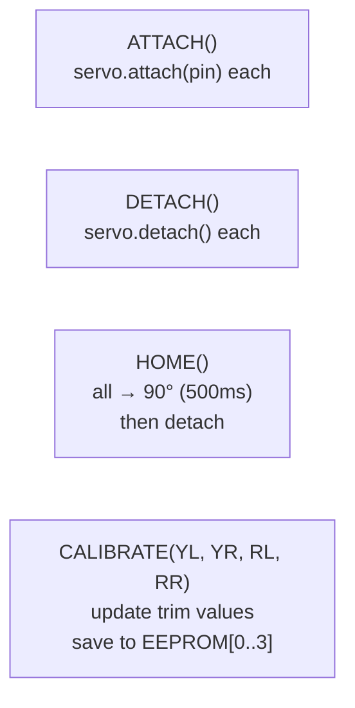

# ZOWI_BASE_v2 — Mermaid Block Diagrams

Este archivo describe el firmware ZOWI_BASE_v2 mediante diagramas Mermaid y tablas.
Cada sección es un diagrama renderizable independiente.

---

## 1. Mode State Machine

Transiciones entre los 5 modos de operación. Los eventos son: botón A, botón B,
botón A+B simultáneo, llegada de datos seriales, y cualquier botón (volver a IDLE).



---

## 2. Setup Flow

Secuencia completa de inicialización al encender o resetear.



---

## 3. Main Loop

Bucle principal con detección de modo y ejecución según el modo activo.



---

## 4. Button Interrupts

Manejadores de interrupción por flanco de subida en los botones.



---

## 5. Movement Reference

| ID | Block | Zowi Method | Parameters |
|----|-------|-------------|------------|
| 0 | HOME / STOP | `home()` | — |
| 1 | WALK FORWARD | `walk(1, T, 1)` | T = period (ms) |
| 2 | WALK BACKWARD | `walk(1, T, -1)` | T = period (ms) |
| 3 | TURN LEFT | `turn(1, T, 1)` | T = period (ms) |
| 4 | TURN RIGHT | `turn(1, T, -1)` | T = period (ms) |
| 5 | UPDOWN | `updown(1, T, moveSize)` | T, moveSize |
| 6 | MOONWALKER LEFT | `moonwalker(1, T, moveSize, 1)` | T, moveSize |
| 7 | MOONWALKER RIGHT | `moonwalker(1, T, moveSize, -1)` | T, moveSize |
| 8 | SWING | `swing(1, T, moveSize)` | T, moveSize |
| 9 | CRUSAITO FORWARD | `crusaito(1, T, moveSize, 1)` | T, moveSize |
| 10 | CRUSAITO BACKWARD | `crusaito(1, T, moveSize, -1)` | T, moveSize |
| 11 | JUMP | `jump(1, T)` | T |
| 12 | FLAPPING FORWARD | `flapping(1, T, moveSize, 1)` | T, moveSize |
| 13 | FLAPPING BACKWARD | `flapping(1, T, moveSize, -1)` | T, moveSize |
| 14 | TIPTOE SWING | `tiptoeSwing(1, T, moveSize)` | T, moveSize |
| 15 | BEND LEFT | `bend(1, T, 1)` | T |
| 16 | BEND RIGHT | `bend(1, T, -1)` | T |
| 17 | SHAKE LEG LEFT | `shakeLeg(1, T, 1)` | T |
| 18 | SHAKE LEG RIGHT | `shakeLeg(1, T, -1)` | T |
| 19 | JITTER | `jitter(1, T, moveSize)` | T, moveSize |
| 20 | ASCENDING TURN | `ascendingTurn(1, T, moveSize)` | T, moveSize |
| 30+ | MANUAL SERVO | `_moveServos(200, raw)` | 4 raw positions (0–180) |



---

## 6. Gesture Reference

| ID | Name | Sequence |
|----|------|----------|
| 0 | HAPPY | S_happy → swing → mouth bigSmile |
| 1 | SUPER HAPPY | S_happy + S_superHappy → tiptoe swing |
| 2 | SAD | sad position → descending tones → sad mouth |
| 3 | SLEEPING | bed position → dream mouth animation → S_sleeping |
| 4 | FART | 3 fart positions → 3 fart sounds → tongueOut mouth |
| 5 | CONFUSED | confused position → S_confused → confused mouth |
| 6 | LOVE | heart mouth → S_cuddly → crusaito |
| 7 | ANGRY | angry position/face → S_confused → jitter |
| 8 | FRETFUL | angry face → fretful oscillation |
| 9 | MAGIC | 4 adivinawi cycles + ascending/descending tones |
| 10 | WAVE | 2 wave cycles + tone sweep |
| 11 | VICTORY | legs up + tones → tiptoe swing → S_happy |
| 12 | FAIL | progressive bend + descending tones → detach servos → long low tone |

---

## 7. Sound Reference

| ID | Song Name | Notes |
|----|-----------|-------|
| 0 | S_connection | Power-on jingle |
| 1 | S_disconnection | Power-off jingle |
| 2 | S_buttonPushed | UI feedback |
| 3 | S_mode1 | Dance mode activation |
| 4 | S_mode2 | Obstacle mode activation |
| 5 | S_mode3 | Noise mode activation |
| 6 | S_surprise | OhOoh surprise |
| 7 | S_OhOoh | Alternate OhOoh |
| 8 | S_cuddly | Affectionate melody |
| 9 | S_sleeping | Lullaby |
| 10 | S_happy | Happy melody |
| 11 | S_superHappy | Super happy melody |
| 12 | S_happy_short | Short happy |
| 13 | S_sad | Sad melody |
| 14 | S_confused | Confused melody |
| 15 | S_fart1 | Fart sound 1 |
| 16 | S_fart2 | Fart sound 2 |
| 17 | S_fart3 | Fart sound 3 |
| 18 | S_fart3 | Long fart |

### Low-level sound blocks



---

## 8. Mouth Reference (LED Matrix 5×6)

30 predefined mouth shapes driven by a 74HC595 shift register (pins 11=SER, 12=RCK, 13=CLK).

```mermaid
flowchart LR
    subgraph MOUTHS["Predefined mouth shapes"]
        direction LR
        M10["10: bigSmile"] --- M11["11: happyOpen"]
        M11 --- M12["12: bigHappyOpen"]
        M12 --- M13["13: heartMouth"]
        M13 --- M14["14: bigHeart"]
        M14 --- M15["15: littleUuh"]
        M15 --- M16["16: dogMouth"]
        M16 --- M17["17: tigerMouth"]
        M17 --- M18["18: catMouth"]
        M18 --- M19["19: tongueOut"]
        M19 --- M20["20: sceptic"]
        M20 --- M21["21: sadMouth"]
        M21 --- M22["22: confMouth"]
        M22 --- M23["23: lineMouth"]
        M23 --- M24["24: smallMouth"]
        M24 --- M25["25: bigSurprise"]
        M25 --- M26["26: medSurprise"]
        M26 --- M27["27: smallSurprise"]
        M27 --- M28["28: thunder"]
        M28 --- M29["29: culito"]
        M29 --- M30["30: openMouth"]
    end
```



### Mouth animations

| Animation | Frames | Description |
|-----------|--------|-------------|
| littleUuh | 8 | Small blinking mouth |
| dreamMouth | 4 | Dreamy mouth with closed eyes |
| adivinawi | 6 | Guessing / magic mouth |
| wave | 10 | Wave pattern |

### Raw mouth

```
RAW MOUTH(30-bit binary)  →  writeFull(pattern)  →  shift register output
```

---

## 9. Sensor Reference



---

## 10. Serial Command Protocol



| CMD | Block | Args | Response |
|-----|-------|------|----------|
| `S` | STOP Zowi | — | `&&A%%` → home → `&&F%%` |
| `L` | MOUTH | 30-bit binary | `&&A%%` → `&&F%%` |
| `T` | TONE | freq_Hz duration_ms | `&&A%%` → `&&F%%` |
| `M` | MOVE | ID T moveSize | `&&A%%` → move → `&&F%%` |
| `H` | GESTURE | ID (0–12) | `&&A%%` → `&&F%%` |
| `K` | SONG | ID (0–18) | `&&A%%` → `&&F%%` |
| `C` | CALIBRATE | YL YR RL RR | `&&A%%` → save EEPROM → `&&F%%` |
| `G` | SERVO RAW | YL YR RL RR | `&&A%%` → move → `&&F%%` |
| `R` | NAME | text string | `&&A%%` → save EEPROM → `&&F%%` |
| `E` | GET NAME | — | `&&E <name>%%` |
| `D` | GET DISTANCE | — | `&&D <cm>%%` |
| `N` | GET NOISE | — | `&&N <value>%%` |
| `B` | GET BATTERY | — | `&&B <%>%%` |
| `I` | GET PROGRAM ID | — | `&&I ZOWI_BASE_v2%%` |

---

## 11. Servo Configuration

| Pin | Identifier | Servo | Role |
|-----|------------|-------|------|
| 2 | `PIN_YL` | YL | Left leg |
| 3 | `PIN_YR` | YR | Right leg |
| 4 | `PIN_RL` | RL | Left foot |
| 5 | `PIN_RR` | RR | Right foot |

### Servo functions



---

## 12. EEPROM Memory Map

| Bytes | Usage | Values |
|-------|-------|--------|
| 0–3 | Trims | YL, YR, RL, RR (signed byte, calibration offsets) |
| 4 | (free) | — |
| 5 | State marker | `'$'` = factory (infinite loop on boot), `'#'` = unbaptized (extended greeting), other = active name |
| 5–15 | Name | Up to 10 characters + null terminator (`\0`) |

---

*Generated from `code/base/ZOWI_BASE_v2.ino` and supporting libraries.*
